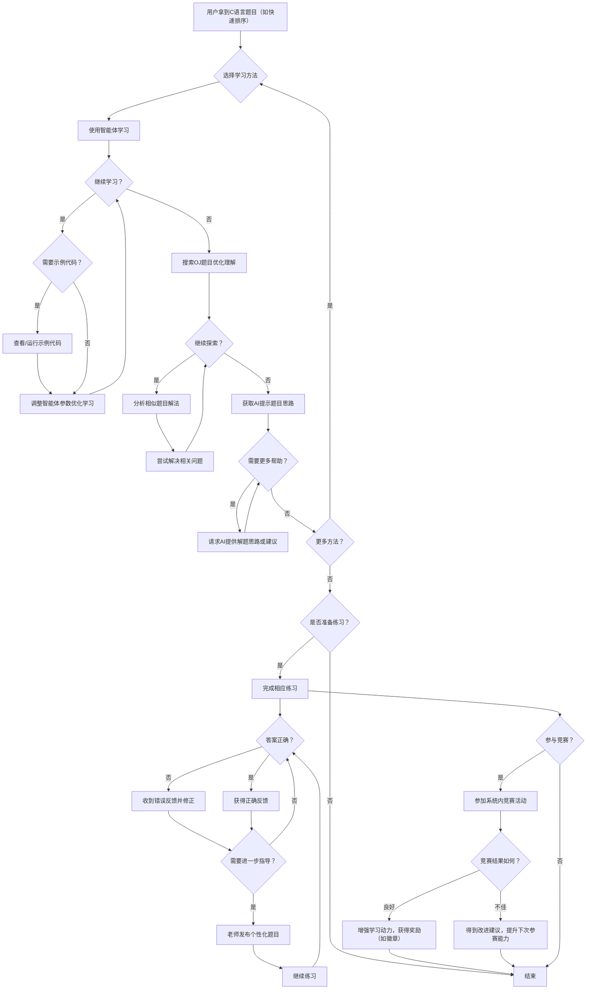

```mermaid
graph TD;
    A[用户拿到C语言题目（如快速排序）] --> B{选择学习方法};
    B --> C[使用智能体学习];
    C --> D{继续学习？};
    D -->|是| E{需要示例代码？};
    E -->|是| F[查看/运行示例代码];
    F --> G[调整智能体参数优化学习];
    G --> D;
    E -->|否| G;
    D -->|否| H[搜索OJ题目优化理解];
    H --> I{继续探索？};
    I -->|是| J[分析相似题目解法];
    J --> K[尝试解决相关问题];
    K --> I;
    I -->|否| L[获取AI提示题目思路];
    L --> M{需要更多帮助？};
    M -->|是| N[请求AI提供解题思路或建议];
    N --> M;
    M -->|否| O{更多方法？};
    O -->|是| B;
    O -->|否| P{是否准备练习？};
    P -->|是| Q[完成相应练习];
    Q --> R{答案正确？};
    R -->|否| S[收到错误反馈并修正];
    S --> T{需要进一步指导？};
    T -->|是| U[老师发布个性化题目];
    U --> V[继续练习];
    V --> R;
    T -->|否| R;
    R -->|是| W[获得正确反馈];
    W --> T;
    P -->|否| X[结束];
    Q --> Y{参与竞赛？};
    Y -->|是| Z[参加系统内竞赛活动];
    Z --> AA{竞赛结果如何？};
    AA -->|良好| AB[增强学习动力，获得奖励（如徽章）];
    AB --> X;
    AA -->|不佳| AC[得到改进建议，提升下次参赛能力];
    AC --> X;
    Y -->|否| X;
```